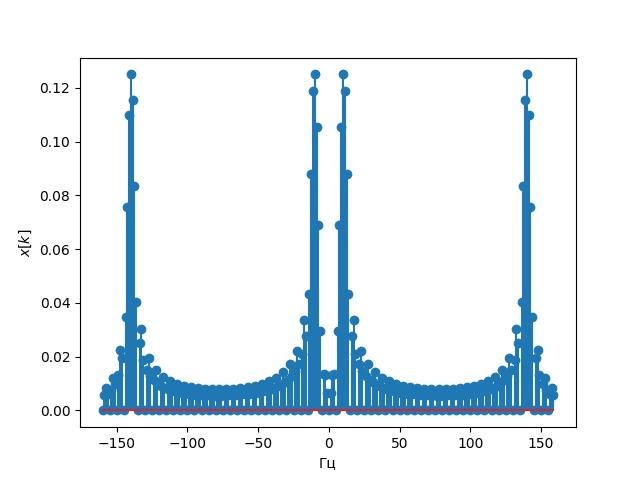
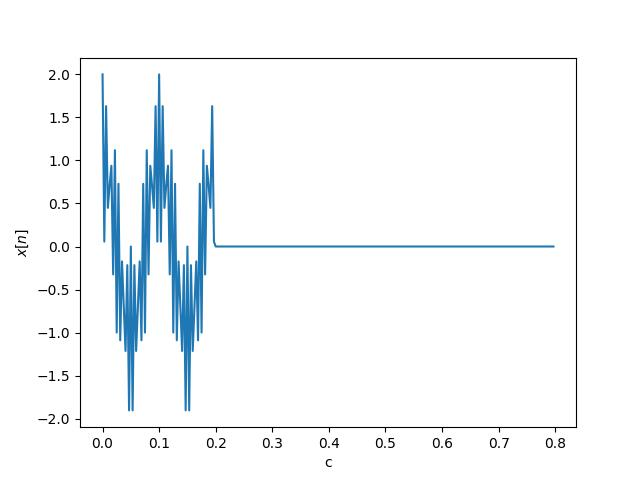

# Цель работы
Целью работы является изучение основных свойств дискретного преобразования Фурье с помощью моделирования в среде Python/Spyder.

# Формирование дискретного сигнала
В данной работе для анализа спектра ДПФ дискретных сигналов используется программное формирование и обработка сигнала на языке Python c применением библиотек (модулей) Numpy, Scipy. 

Визуализация дискретных сигналов и результатов вычисления ДПФ выполняется при помощи модуля Matplotlib.
Дискретные отсчеты сигналов (гармонических колебаний) определяются путем задания интервала дискретизации и формирования векторов отсчетов времени, в которых вычисляются дискретные значения сигнала.

# Задание на работу
## Task 1
1. Для заданных значений частоты сигнала и частоты дискретизации получите дискретное колебание, отсчеты посмотрите в Variable Explorer. Далее увеличьте частоту сигнала в несколько раз, при этом так же увеличится и частота дискретизации, но отношение частоты сигнала и частоты дискретизации - нормированная частота останется той же величиной.
Сравните дискретные отсчеты первого и второго сигналов.
2. Вычислите шаг частот между точками ДПФ ∆f =fs/N. Определите, в какой точке ДПФ находится заданный сигнал.
3. Измените частоту сигнала в целое чисто раз, определите номер точки
ДПФ для данного сигнала.
4. Измените количество точек ДПФ до 512. Вычислите шаг частот между
точками ДПФ ∆f = fs/N. Определите, в какой точке ДПФ находится заданный сигнал.
5. Задайте сигнал в виде суммы двух колебаний. Вычислите ДПФ сигнала.
6. Вычислите ОДПФ сигнала, заданного в частотной области в виде X=np.array([0,0,1]).
7. Задавайте ненулевое значение в различных разрядах. Также задайте значение в комплексной форме X=np.array([0,0,1j,0,0,0,0,0]), поменяйте знак мнимой единицы, задайте спектр ДПФ в виде X=np.array([0,0,2-1j,0,0,0,0,0]) поменяйте знак мнимой единицы. Можно увеличить количество точек до 16 при одном ненулевом значении.

# Полученные графики

  
  ДПФ

  
  Модуль ДПФ

  
  ОДПФ

  
  ОДПФ для комплексного числа

  

  
  ОДПФ и ОДПФ для комплексного числа

  

  
  ОДПФ для суммы сигналов

  

  
Спектрограмма суммы сигналов

## Task 2
1. Настроить SDR принимать сигнал на частоте канала Wi-Fi определённой точки доступа (см [4. Изучение основных параметров библиотеки PyAdi для Adalm Pluto SDR](https://github.com/TheMightyOoze147/PlutoSDR_practise/tree/main/4.%20%D0%98%D0%B7%D1%83%D1%87%D0%B5%D0%BD%D0%B8%D0%B5%20%D0%BE%D1%81%D0%BD%D0%BE%D0%B2%D0%BD%D1%8B%D1%85%20%D0%BF%D0%B0%D1%80%D0%B0%D0%BC%D0%B5%D1%82%D1%80%D0%BE%D0%B2%20%D0%B1%D0%B8%D0%B1%D0%BB%D0%B8%D0%BE%D1%82%D0%B5%D0%BA%D0%B8%20PyAdi%20%D0%B4%D0%BB%D1%8F%20Adalm%20Pluto%20SDR)) 
2. Построить графики ДПФ для полученного сигнала

# Полученные графики

    
    
    
    
    
    
    
    
    
    

